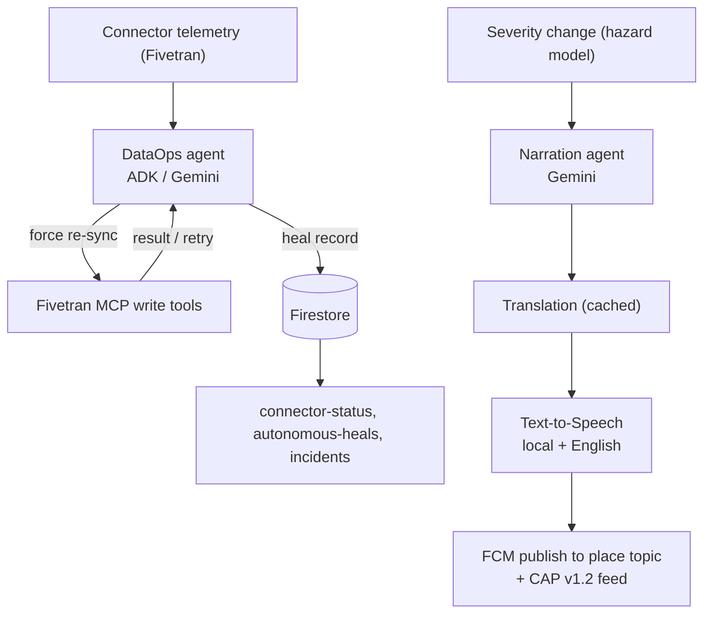

# AGENTS_USE.md

How Centinela uses agents: what they are, what they can do, how they are orchestrated and grounded, and where to see the evidence.

## 1. Agent Overview

Centinela runs two Gemini-based agents with separate, narrow jobs:

1. **DataOps self-heal agent** keeps the data pipeline fresh. It detects stale Fivetran connectors and restores them through the Fivetran MCP server, autonomously, with retries and an auditable record.
2. **Narration agent** turns a place's current severity and dominant hazard into short, plain-language guidance that is then translated and spoken for residents.

Both run on Gemini via Vertex AI. The first is the autonomous operator; the second is a focused text generator in the alert path.

## 2. Agents and Capabilities

### Agent: DataOps self-heal agent

- **Framework:** Google Agent Development Kit (`LlmAgent`) on Vertex AI Gemini, location pinned to `us`.
- **Job:** monitor Fivetran connector freshness and fix staleness without a human.
- **Freshness rule:** a connector is stale if its last successful sync is more than 5 minutes ago, or it never succeeded and setup is incomplete.
- **Tools:** the Fivetran MCP server's write tools (force re-sync, raise sync frequency) via an `McpToolset` over stdio, plus a `sleep` tool for backoff.
- **Guardrails:** writes are idempotent and non-destructive; retries are bounded (about 2s then 4s, up to 3 attempts); failures are surfaced as "pipeline degraded," never silenced.
- **Output:** an auditable heal record per action, exposed at `/autonomous-heals` and in the incident history.

### Agent: Narration agent

- **Framework:** Gemini (Vertex AI) narration loop.
- **Job:** write the plain-language guidance shown on the public alert card for the current severity and dominant hazard.
- **Grounding:** the canonical text is English and reflects the model's severity and hazard, not free invention.
- **Downstream:** Cloud Translation renders the resident-language version (cached, human-correctable, with an original-English toggle); Cloud Text-to-Speech produces audio in both the resident language and English.

## 3. Architecture and Orchestration

### Diagram

### Orchestration approach

The two agents are not a chained pipeline; they operate on independent triggers. The DataOps agent reacts to connector telemetry; the narration agent runs in the alert path when a place's severity changes. This keeps each agent's context small and its failure modes isolated.

### State management

Durable state lives in Firestore: risk-history ticks, push subscriptions, incidents, and the heal log. In-memory fallbacks back the same interfaces for local and test runs. Cloud Run instances are ephemeral, so nothing the agents produce is kept only in process memory.

### Error handling and handoff

- DataOps writes run in a bounded retry loop; on exhaustion the agent hands off to humans by surfacing a degraded state rather than failing quietly.
- Narration and its translation/speech steps fail soft: if a downstream step is unavailable, the core risk view still renders and the gap is recorded.

## 4. Context Engineering

### Context sources

- **DataOps agent:** Fivetran connector state (last sync, status) read through the MCP server. Its instruction encodes the freshness rule and the retry policy, so the decision logic is explicit, not implicit in prompts.
- **Narration agent:** the place's severity, dominant hazard, and the plain-language guidance template. It is given exactly what it needs to describe the current situation and nothing more.

### Strategy

Both agents are kept on a short leash: narrow instructions, small inputs, and a fixed set of tools. The DataOps agent's instruction is operational (detect, act, retry, surface), which keeps it from wandering into open-ended behavior. The narration agent produces a bounded piece of text per severity, which is then cached so it is generated once per state, not per request.

### Token management

Narration output is cached per (place, severity), translation is cached per string, and audio is cached per (text, language, voice). Steady-state alerts therefore reuse cached artifacts and do not re-bill the model or the translation/speech services until the underlying content changes.

### Grounding

The narration agent is grounded in the model's computed severity and hazard, and the alert copy is explicit that the index is a MODEL and a demonstration, not an official authority. The DataOps agent is grounded in real connector telemetry and acts only through real MCP write tools, so its actions correspond to actual pipeline operations.

## 5. Use Cases

### Use case 1: A connector goes stale
A Fivetran connector stops syncing. The DataOps agent detects the staleness (no success in 5 minutes), forces a re-sync and raises the frequency through the MCP write tools, retries with backoff if a call fails, and records the heal. The Diagnostics slideout and `/autonomous-heals` show what happened.

### Use case 2: A city's risk rises
The hazard model moves a place from Low to Warning. The narration agent writes the guidance; Cloud Translation renders it in the resident language; Cloud Text-to-Speech produces audio; Firebase Cloud Messaging publishes one message to that place's topic; the CAP v1.2 feed reflects the new alert.

### Use case 3: Demonstration injection
An operator injects a SIMULATED M7.2 near a place from the Diagnostics slideout. The pipeline reacts as it would to real data, but everything generated for the demonstration is labeled SIMULATED, so it can never be mistaken for a real warning.

### Use case 4: A non-monitored place
For an N.A.M. place, there is no live index; the backend computes an activity score from public earthquake and river records and the UI labels it as history, with no alerts.

### Use case 5: A machine consumer
An emergency-management system reads `/cap.xml` and ingests Centinela alerts as standard OASIS CAP v1.2, with English and resident-language info blocks and a sender clearly marked as a demonstration system.

## 6. Observability

### Logging
Structured logs from Cloud Run capture pipeline events and agent actions; secret values are never logged.

### Pipeline and agent visibility
- `/connector-status` - current freshness of each connector.
- `/autonomous-heals` - the audit log of agent heals.
- `/incidents` and incident history - what happened and when, including reopen.
- The **Diagnostics slideout** in the UI surfaces all of the above live, plus controls to simulate an outage and inject SIMULATED events.

### Evidence
- Live app: https://centinela-v1-765013283380.us-central1.run.app
- Connector status: `/connector-status`
- Autonomous heals: `/autonomous-heals`
- CAP feed: `/cap.xml`
- Demo controls: Diagnostics slideout (break, heal, inject SIMULATED event)

## 7. Security and Guardrails

- **Bounded autonomous writes.** The DataOps agent can only force re-sync and raise frequency, both idempotent and non-destructive. There is no delete or schema-mutation path.
- **Retry caps.** Bounded retries with backoff prevent runaway loops and API hammering.
- **No silent failure.** Unrecoverable states are surfaced as degraded, never hidden.
- **Auditability.** Every heal is recorded and reviewable.
- **MCP isolation.** The agent reaches Fivetran only through the MCP toolset; it has no broader ambient credentials.
- **Honest output.** Narrated alerts are labeled MODEL and defer to local civil protection authorities; demonstrations are labeled SIMULATED.

See [SECURITY.md](SECURITY.md) for the full model.

## 8. Scalability

The agents do not scale with traffic. The DataOps agent acts only on staleness, and narration is cached per severity, so resident growth and request volume do not increase agent cost. Per-place FCM topics absorb fan-out. See [SCALING.md](SCALING.md) for the full strategy and cost drivers.

## 9. Lessons Learned

### What worked well
- **A narrow operator agent.** Scoping the DataOps agent to one job with explicit freshness and retry rules made its behavior predictable and its blast radius small.
- **Real MCP writes, not mocks.** Giving the agent a genuine, auditable write path made the self-heal demonstrable rather than theoretical.
- **Cache by content.** Caching narration, translation, and audio by content kept steady-state cost near zero and made the alert path fast.

### What we would do differently
- **Schedule periodic work externally from day one.** Request-driven Cloud Run does not run in-process background loops without traffic; freshness checks and recompute belong on an external scheduler hitting an endpoint.
- **Treat state as durable from the start.** Anything an agent produces must live in Firestore, because instances are ephemeral.

### Key technical decisions
- ADK + Fivetran MCP for an auditable, bounded self-heal path.
- Per-place FCM topics so resident scale does not add backend work.
- Honest labeling (MODEL, SIMULATED, deferral to authorities) as a hard product constraint, not an afterthought.

## 10. Responsible AI

- **Transparency.** The risk index is labeled MODEL everywhere and described as a demonstration; the technology page explains how it works in plain language.
- **Human oversight.** Every alert tells residents to follow their local civil protection authority and warns that the model can be wrong, late, or incomplete.
- **Fairness.** Per-place baselines compare each city against its own history rather than a global threshold, so wet and dry regions are judged on their own terms; small streams are dampened to avoid false alarms.
- **Privacy.** No accounts, no tracking; the only device-linked datum is a removable push token. Hazard data is about places, not people.
- **Accountability.** The agent's actions are recorded and reviewable; translations are cached and human-correctable.
