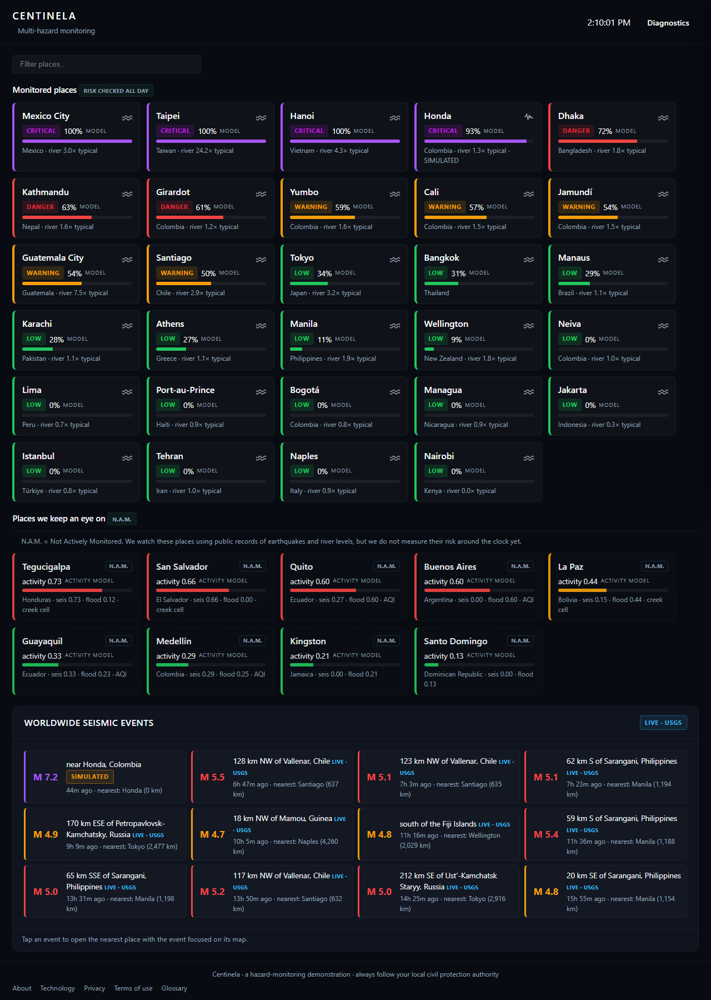
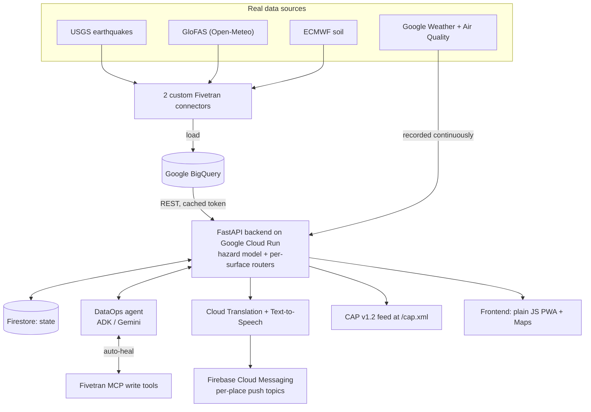
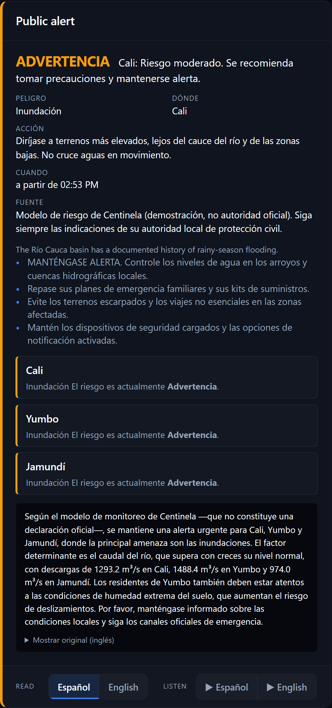
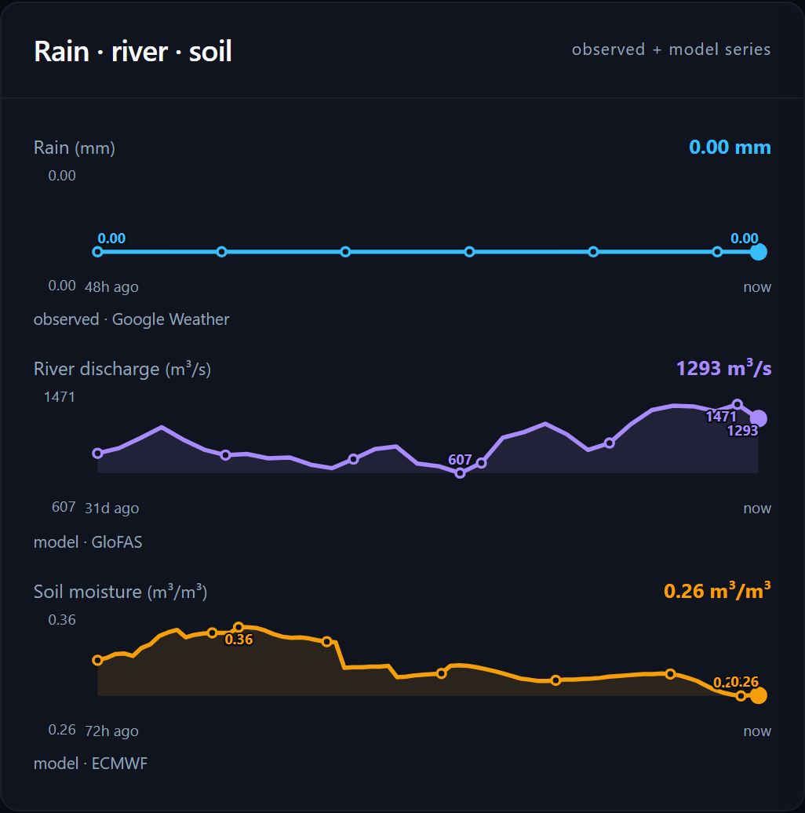
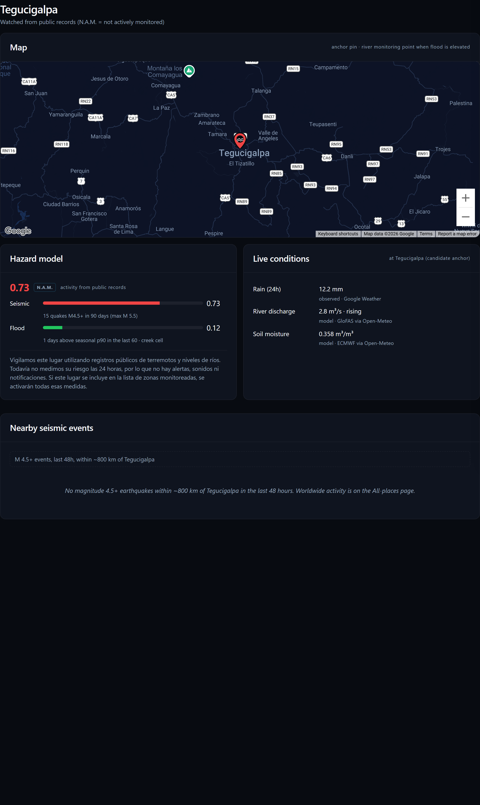

# Centinela

> Multi-hazard monitoring that turns live, real measurements into one plain risk level per city, speaks the resident's language, and keeps its own data pipeline healthy without a human watching.

[](LICENSE)
[](https://centinela-v1-765013283380.us-central1.run.app)
[](https://centinela-v1-765013283380.us-central1.run.app)
[](https://centinela-v1-765013283380.us-central1.run.app/cap.xml)
[](https://devpost.com/software/centinela-nivb7o)

**[Watch the demo](https://youtu.be/dYvGX69SiUY)**  ·  **[Open the live app](https://centinela-v1-765013283380.us-central1.run.app)**  ·  **[Devpost](https://devpost.com/software/centinela-nivb7o)**  ·  **[API docs](https://centinela-v1-765013283380.us-central1.run.app/docs)**  ·  **[The story behind it](JOURNEY.md)**

[](https://youtu.be/dYvGX69SiUY)



Centinela watches natural hazards (floods, heavy rain, unstable ground, and earthquakes) in 29 cities around the world, plus 9 more it keeps an eye on, and turns real measurements into one plain risk level per place: Low, Warning, Danger, or Critical. Everything on the map comes from real data: a global river model, weather services, and the United States Geological Survey. When the risk for a city rises, residents who subscribed get a push notification, can read the advice in their own language, and can listen to it spoken aloud.

Behind the map, an autonomous DataOps agent keeps the data pipeline healthy: when a connector goes stale, the agent forces a re-sync through the Fivetran MCP server, with retries and an auditable action history, and never silently hides a degraded pipeline.

## Key Facts

| Item | Value |
|------|-------|
| Monitored cities | 29 (live risk index, around the clock) |
| Watched places (N.A.M.) | 9 (public-record activity, not actively monitored) |
| Hazard signals blended | 4 (river discharge, observed rain, soil wetness, nearby earthquakes) |
| Data connectors | 2 custom Fivetran connectors into BigQuery |
| Agents | 2 (DataOps self-heal agent + plain-language narration agent), both on Gemini |
| Real data sources | USGS, GloFAS (via Open-Meteo), ECMWF, Google Weather + Air Quality |
| Resident reach | Per-place push topics (FCM), translated alerts, dual-language spoken audio |
| Standards feed | OASIS CAP v1.2 at `/cap.xml` |
| Install | Progressive Web App (installable, offline app shell) |
| Frontend | Plain JavaScript ES modules + Google Maps (no framework) |
| Test suites | 4 (regression, demo endpoints, history endpoints, seismic events) |

Nothing is seeded or hand-entered. Even coordinates are derived, by geocoding each place name and probing the river-model grid for the strongest channel nearby. Anything simulated for a demonstration is always labeled SIMULATED.

## Architecture



## Tech Stack

| Layer | Technology |
|-------|------------|
| Backend | Python, FastAPI, Uvicorn |
| Hosting | Google Cloud Run (source build, Buildpacks) |
| State | Google Firestore (in-memory fallbacks for local/dev) |
| Warehouse | Google BigQuery (queried via REST with a cached access token) |
| Ingestion | Fivetran (2 custom connectors) |
| Agent framework | Google Agent Development Kit (ADK) on Vertex AI Gemini |
| Agent tools | Fivetran MCP server (write tools for re-sync) |
| Narration model | Gemini (Vertex AI) |
| Translation / speech | Google Cloud Translation, Google Cloud Text-to-Speech |
| Push | Firebase Cloud Messaging (per-place topics) |
| Maps | Google Maps JavaScript API |
| Frontend | Plain JavaScript ES modules, Google Maps, PWA (service worker + manifest) |
| Hazard data | USGS (seismic), GloFAS via Open-Meteo (discharge), ECMWF (soil), Google Weather + Air Quality |

## Project Structure

```
rapid-agent/
  Procfile                      # web: uvicorn api.main:app
  requirements.txt              # google-adk, mcp, fivetran-mcp, google-cloud-* , firebase-admin
  agent.py                      # re-exports the root agent for the ADK runtime
  rapid_agent/
    agent.py                    # DataOps self-heal agent (ADK LlmAgent on Vertex Gemini)
    centinela_agent.py          # narration loop (plain-language alert text)
    narrate.py                  # narration helpers
    populate.py                 # place/registry population helpers
  api/
    main.py                     # composition root: app + CORS + router includes
    core.py                     # env, clients, feature flags (imported first)
    config.py                   # place registry + constants
    stores.py                   # Firestore + in-memory fallbacks
    resolution.py               # derived coordinates (geocode + river-grid probe)
    hazard.py                   # the risk model (4 signals, 92-day baseline) + weather recorder
    places_resolver.py          # pure resolution logic
    narration.py                # Gemini narration caches
    risk_routes.py              # /risk, /risk-all, /risk-history, /telemetry-history
    alert_routes.py             # /alert, /alert-audio, /cap.xml (CAP v1.2)
    push_routes.py              # /register-token, /subscribe-place, /unsubscribe-place
    conditions_routes.py        # /location-conditions (rain + air quality)
    seismic_routes.py           # /seismic-events, /live-seismic, /seismic-focus
    connector_routes.py         # /connector-status, /autonomous-heals, /break, /heal
    places_routes.py            # /places, /basins, /group-summaries, /places/resolve
    watchlist_routes.py         # /watchlist (N.A.M. places)
    incident_routes.py          # /incidents, reopen, history
    demo_routes.py              # /demo/* (clearly SIMULATED), /check-alerts
    static_routes.py            # /, site pages, assets, manifest, service worker
    i18n.py, narration.py, tts.py, demo.py, watchlist.py
  web/
    index.html                  # single-page shell (index grid + detail view)
    style.css                   # dark theme
    manifest.json               # PWA manifest
    firebase-messaging-sw.js    # service worker: push + app-shell caching (offline)
    js/                         # ES modules (main, poll, tiles, detail, map, charts, alert-card, ...)
    pages/                      # about, technology, privacy, terms, glossary
  test_regression.py            # broad regression suite
  test_demo_endpoints.py        # demo controls
  test_history_endpoints.py     # risk + telemetry history
  test_seismic_events.py        # seismic feed
```

## Features

### Hazard intelligence
- **One risk level per place** blended from four real signals: river discharge against that place's own 92-day baseline, observed 24-hour rain, soil wetness as an amplifier, and the strongest recent earthquake nearby. The strongest hazard dominates; co-occurring hazards raise it further. Small streams are dampened so a creek cannot read like a major river flood.
- **Honest labeling**: the index is our own model and is marked MODEL everywhere; alert copy states it is a demonstration, not an official authority, and tells people to follow their local civil protection authority.
- **N.A.M. places**: for the 9 watched-but-not-actively-monitored cities, the site shows an activity score from public earthquake and river records, clearly labeled, with no alerts.
- **Worldwide seismic feed** live from USGS; tap an event to open the nearest place with the event focused on its map.

### Reaching residents
- **Per-place push notifications** through Firebase Cloud Messaging topics: one topic per place, one message per severity change.
- **Translated alerts** via Cloud Translation (cached per string, human-correctable), with an always-available original-English toggle.
- **Spoken audio** via Cloud Text-to-Speech, in the resident language and in English.
- **Installable PWA** with an offline app shell, so the page opens from a home-screen icon and still loads the last data seen without a network.
- **CAP v1.2 feed** at `/cap.xml` for emergency-management systems.
- **Plain-language site pages**: about, technology (with diagrams), privacy, terms, glossary, opened as in-page modals.

### Self-healing pipeline
- **Autonomous DataOps agent** (Google ADK on Gemini) watches the Fivetran connectors. If one goes stale (no successful sync in 5 minutes, or setup never completed), the agent uses the Fivetran MCP write tools to force a re-sync and raise the sync frequency, with bounded retries and a visible, auditable heal history. It never silences a degraded pipeline.
- **Diagnostics slideout** in the UI shows connector freshness, autonomous heals, and incident history, plus demo controls to simulate an outage or inject a SIMULATED event.

### A look at it

A monitored city's public alert, translated into the resident's language, with controls to read or listen in either language:



Live history for that place: observed rain, modeled river discharge, and soil moisture, with labeled axes and point values:



A place we only keep an eye on (N.A.M.): an activity score from public earthquake and river records, clearly labeled as history, with no alerts:



More views, including the full city detail, the map, the worldwide seismic feed, and the self-healing diagnostics panel, are in [SCREENSHOTS.md](SCREENSHOTS.md).

## Quick Start

```bash
# 1. Clone
git clone https://github.com/marylin/centinela.git && cd centinela

# 2. Python deps
python -m venv .venv
. .venv/Scripts/activate      # Windows;  source .venv/bin/activate on macOS/Linux
pip install -r requirements.txt

# 3. Run the backend locally (TESTING uses in-memory fallbacks, no live GCP needed)
TESTING=true python -m uvicorn api.main:app --port 8000

# 4. Open the UI
#    http://127.0.0.1:8000
```

See [QUICKGUIDE.md](QUICKGUIDE.md) for full setup, GCP configuration, deployment, and troubleshooting.

## Live Demo

- **Demo video:** https://youtu.be/dYvGX69SiUY
- **Devpost entry:** https://devpost.com/software/centinela-nivb7o
- **App (frontend + API):** https://centinela-v1-765013283380.us-central1.run.app
- **API docs:** https://centinela-v1-765013283380.us-central1.run.app/docs
- **CAP v1.2 feed:** https://centinela-v1-765013283380.us-central1.run.app/cap.xml
- **Source repo:** https://github.com/marylin/centinela

## How It Works

1. **Ingest.** Two custom Fivetran connectors load the global USGS earthquake feed and daily river discharge (GloFAS via Open-Meteo) plus soil moisture (ECMWF) for every place into BigQuery. Observed rainfall and air quality come from the Google Weather and Air Quality APIs and are recorded continuously.
2. **Resolve.** Each place name is geocoded, and the river-model grid is probed for the strongest channel nearby, so coordinates and the river monitoring point are derived rather than hand-set.
3. **Score.** The hazard model reads each place's signals from BigQuery and computes a 0 to 1 risk index against that place's own 92-day baseline. The strongest hazard sets the level; co-occurring hazards push it higher.
4. **Narrate.** A Gemini narration step writes plain-language guidance for the current severity. Cloud Translation renders it in the resident language (cached, human-correctable); Cloud Text-to-Speech produces audio.
5. **Reach.** On a severity change, Firebase Cloud Messaging publishes one message to that place's topic. The web app installs as a PWA and exposes the alert as a standards-compliant CAP v1.2 feed.
6. **Self-heal.** The DataOps agent continuously checks connector freshness. A stale connector triggers an MCP-driven re-sync with retries and an auditable heal record; a pipeline that cannot recover is surfaced as degraded, never hidden.

## Documentation

- [AGENTS_USE.md](AGENTS_USE.md) - Agents, orchestration, context engineering, use cases, evidence
- [ARCHITECTURE.md](ARCHITECTURE.md) - System design and decisions
- [SECURITY.md](SECURITY.md) - Security and responsible-AI architecture
- [SCALING.md](SCALING.md) - Scaling strategy and cost drivers
- [QUICKGUIDE.md](QUICKGUIDE.md) - Setup, deployment, and troubleshooting
- [DEMO.md](DEMO.md) - Guided walkthrough of the live app for reviewers
- [SCREENSHOTS.md](SCREENSHOTS.md) - Full screenshot gallery
- [JOURNEY.md](JOURNEY.md) - The non-technical story: goals, blockers, and lessons
- [GEMINI.md](GEMINI.md) - Project context (architecture, commands, structure)
- [.env.example](.env.example) - Environment variable template

## License

MIT License. See [LICENSE](LICENSE).
