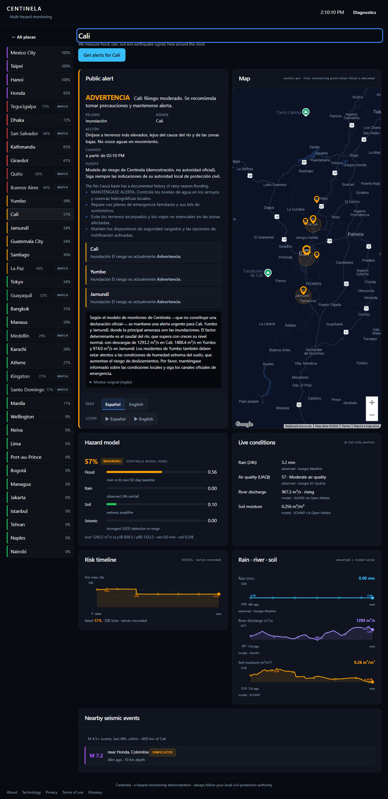
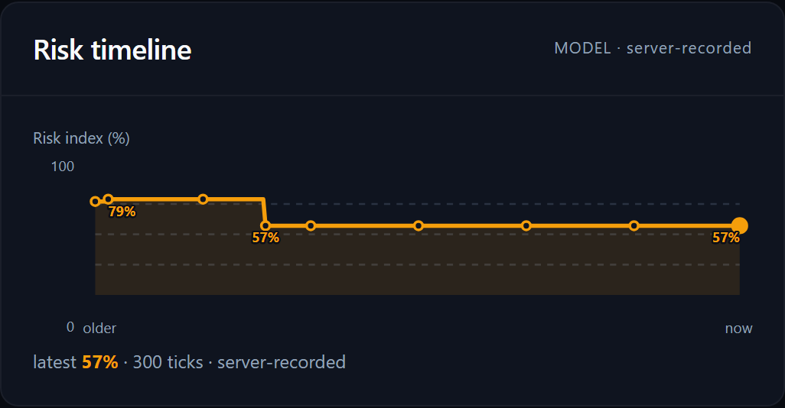
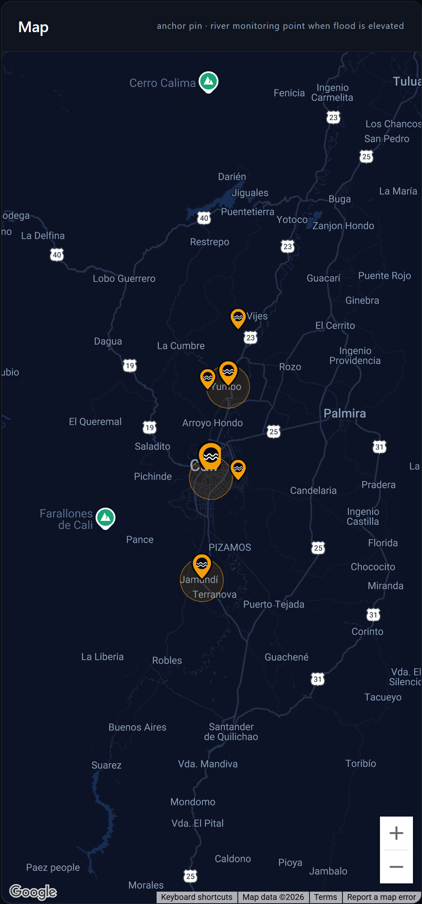
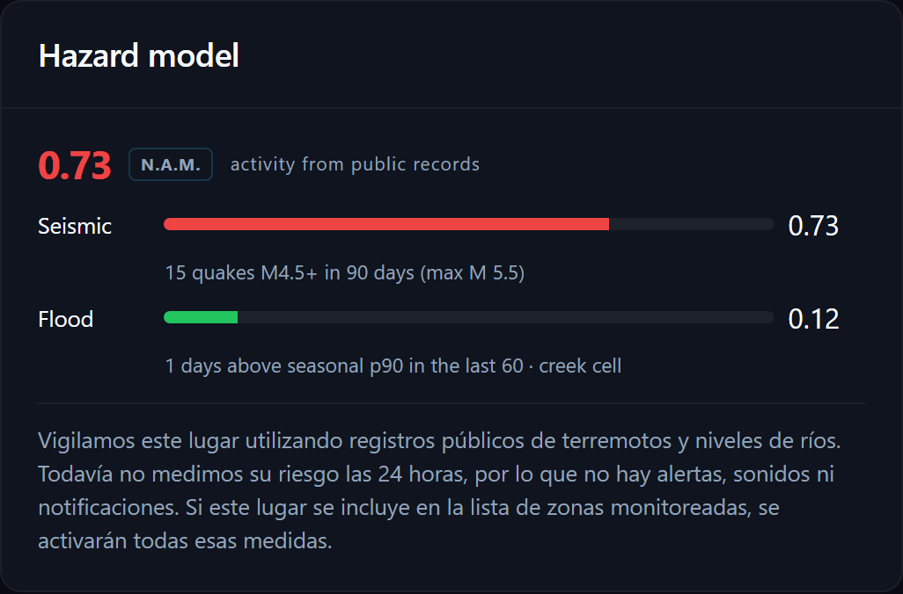
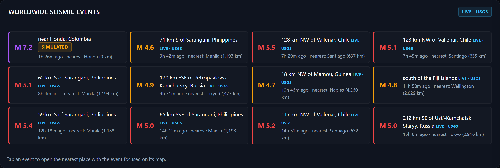
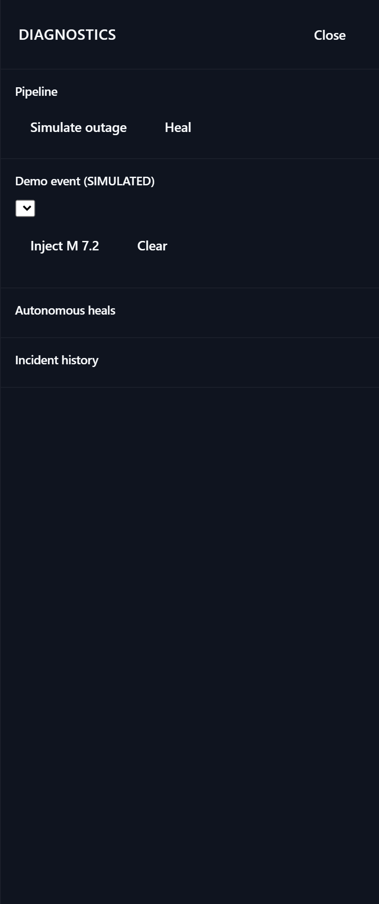

# Screenshots

A fuller look at Centinela. Everything here is the live app on real data, except anything the interface marks SIMULATED. Try it yourself at https://centinela-v1-765013283380.us-central1.run.app.

## All places

Every monitored city with its current risk level, the places we keep an eye on, and a live worldwide seismic feed.

## A monitored city

The full detail view: the translated public alert, the map, the hazard breakdown, live conditions, and history.

### Public alert, translated

The alert in the resident's language, with the per-area warnings, the spoken broadcast, and controls to read or listen in either language.

### History per place

Observed rain, modeled river discharge, and soil moisture, each with labeled axes, a time window, and point values.

### Risk over time

The recorded risk index for the place, on a fixed scale with the latest reading marked.

### Map

The place anchor and, when flood risk is elevated, the river monitoring point.

## A watched place (N.A.M.)

A place we do not monitor around the clock. It shows an activity score from public earthquake and river records, labeled as history, with no alerts.

## Worldwide seismic feed

Live earthquakes from the United States Geological Survey. Tap an event to open the nearest place with it focused on the map.

## Self-healing pipeline

The diagnostics panel shows connector freshness, the autonomous heal log, and incident history, with controls to simulate an outage or inject a SIMULATED event.

